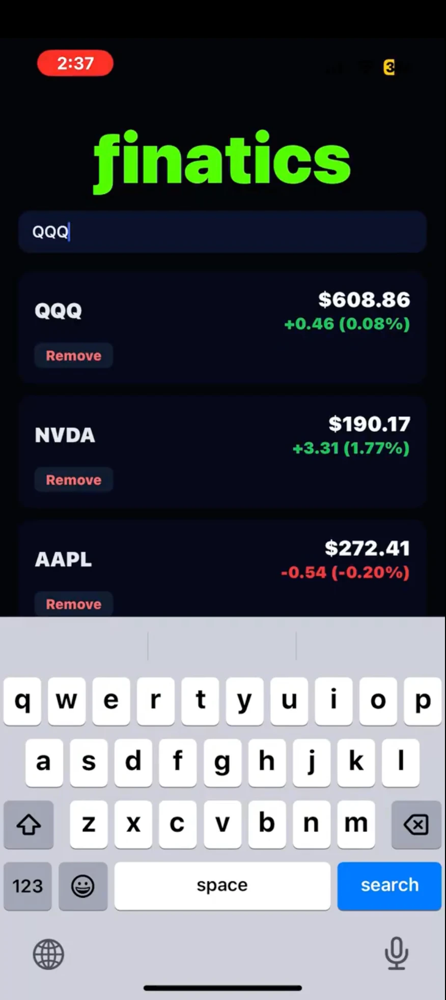

# ƒinatics

A mobile stock quote tracker built with Expo and React Native. Search for a ticker, get live pricing from the Finnhub API, and build up a running watchlist of the symbols you're following.

<p align="center">
  
</p>

## What it does

Once you pause typing, the search field queries Finnhub's symbol search endpoint and shows up to five matches with their ticker and company description. Tapping a suggestion — or submitting the field directly — pulls that symbol's latest quote and pins it to the top of the watchlist.

Each card shows the current price alongside the day's change in both dollars and percent, colored green or red by direction. Symbols already in the list get replaced rather than duplicated when re-searched, and each card carries its own remove button.

The watchlist lives in component state, so it resets when the app restarts. Adding persistence with AsyncStorage would be the natural next step.

## Stack

Expo SDK 54 on React Native 0.81 and React 19. No navigation library, no state management library, no component library — one screen, styled with `StyleSheet`, running against Finnhub's REST endpoints via `fetch`.

## Running it

You'll need a free Finnhub API key from [finnhub.io](https://finnhub.io). Copy the example env file and paste your key into it:

```bash
cp .env.example .env
```

```bash
# .env
EXPO_PUBLIC_FINNHUB_API_KEY=your_key_here
```

Then install and start:

```bash
npm install
npx expo start
```

Scan the QR code with Expo Go, or press `i` / `a` in the terminal for the iOS simulator or an Android emulator. `npx expo start --web` runs it in the browser.

## API key

The app calls two Finnhub endpoints, `/quote` and `/search`, both of which need an API key. `App.js` reads it from `EXPO_PUBLIC_FINNHUB_API_KEY`, and `.env` is gitignored so the key never lands in the repo. If you change `.env` while Expo is running, restart with `npx expo start -c` to clear the cache.

Worth being clear about the limit of this setup: anything prefixed `EXPO_PUBLIC_` is inlined into the JavaScript bundle at build time, so it ships to the device and can be extracted from the app. Keeping it out of the repo stops it leaking through GitHub, but it doesn't hide it from a determined user. The only real fix is a small backend that holds the key and proxies the Finnhub calls — worth doing if this ever goes to an app store, unnecessary while it's a portfolio project.

## Known limitations

- **No persistence.** The watchlist is in-memory and clears on restart.
- **Quotes don't refresh.** Prices are fetched once when a symbol is added and stay frozen after that. There's no polling, no pull-to-refresh, and no websocket.
- **Coarse error handling.** Network failures, bad symbols, and rate-limit responses all collapse into the same generic message.

## License

MIT
